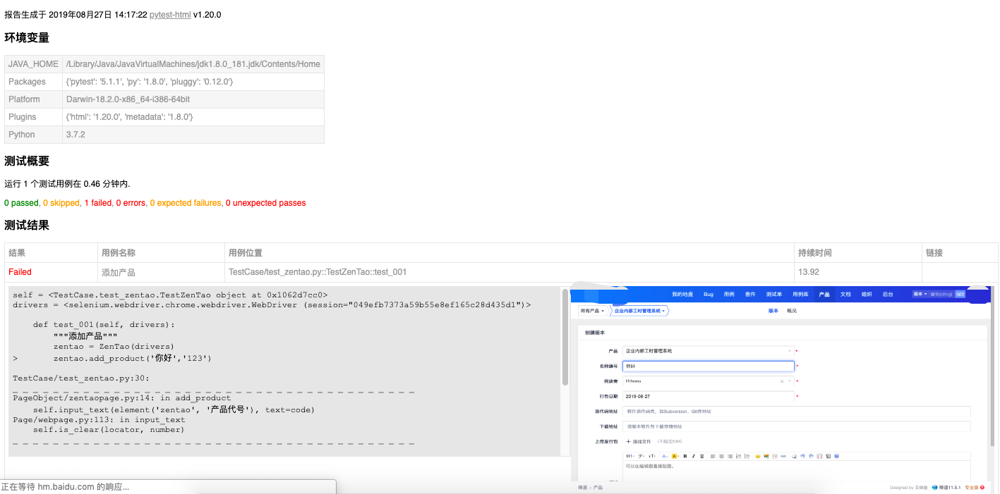

# 汉化版的pytest—HTML报告


## 第一步：下载本项目的压缩包
---
## 第二步：将下载的压缩包解压
---
#### 解压后有两个文件夹

	1. pytest_html
	2. pytest_html-1.20.0.dist-info

## 第三步：进入python
---
	1. 系统环境请查找系统python的site-package文件夹
	2. 虚拟环境请在venv中的site-package文件夹


## 第四步：将文件夹放至site-package
---
	1. 复制解压的上面两个文件夹
	2. 移动至site-package，如提示替换，点击全部替换

## 第五步：添加或修改conftest.py文件中两个方法
---
```python
@pytest.mark.optionalhook
def pytest_html_results_table_header(cells):
	cells.insert(1, html.th('用例名称'))
	cells.insert(2, html.th('Test_nodeid'))
	cells.pop(2)


@pytest.mark.optionalhook
def pytest_html_results_table_row(report, cells):
	cells.insert(1, html.td(report.description))
	cells.insert(2, html.td(report.nodeid))
	cells.pop(2)
```


# 结果图片
---
 
